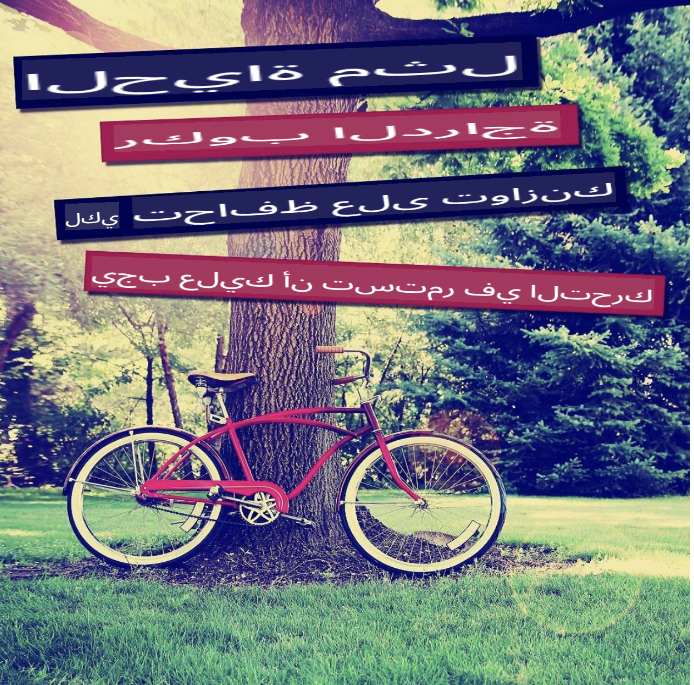

# عنوان الاختبار

اختبار الشفرة العينية:

```
import os
import dotenv
from openai import AzureOpenAI

# تحميل متغيرات البيئة
dotenv.load_dotenv()

# الحصول على معلومات Azure OpenAI ذات الصلة من متغيرات البيئة
aoai_endpoint = os.getenv('AZURE_OPENAI_ENDPOINT')
aoai_key = os.getenv('AZURE_OPENAI_API_KEY')
aoai_version = os.getenv('AZURE_OPENAI_VERSION')

# تهيئة عميل Azure OpenAI
client = AzureOpenAI(
    azure_endpoint=aoai_endpoint,
    api_key=aoai_key,
    api_version=aoai_version
)


```





تنويه: تم ترجمة الترجمة من الأصل بواسطة نموذج AI وقد لا تكون مثالية. يرجى مراجعة النتائج وإجراء أي تصحيحات ضرورية.